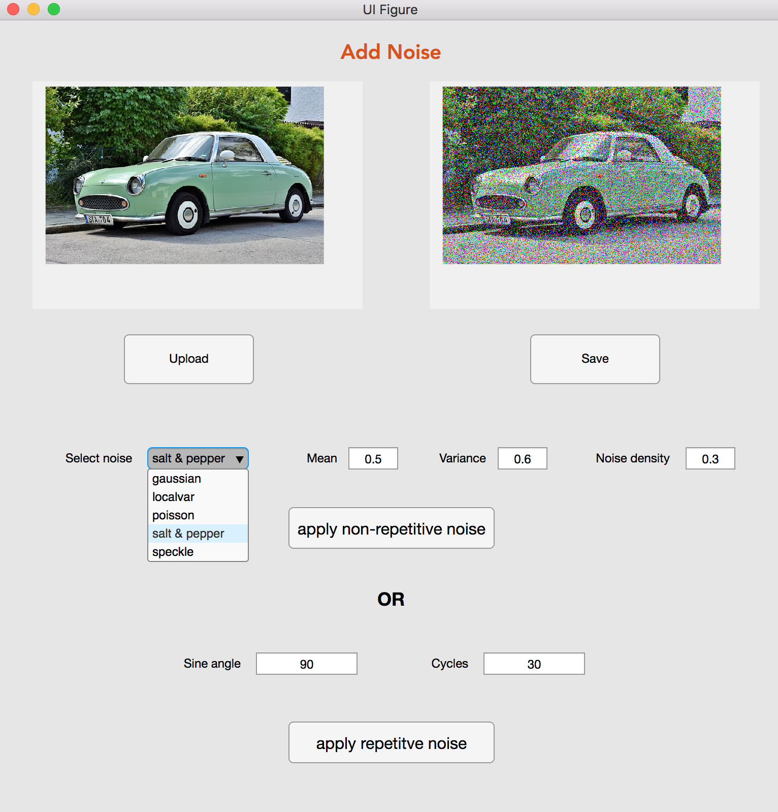
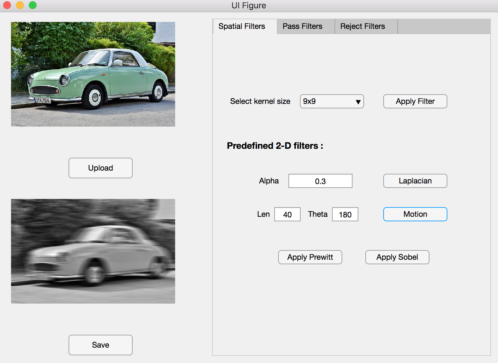
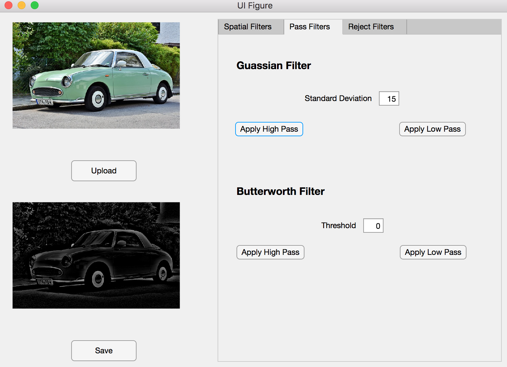
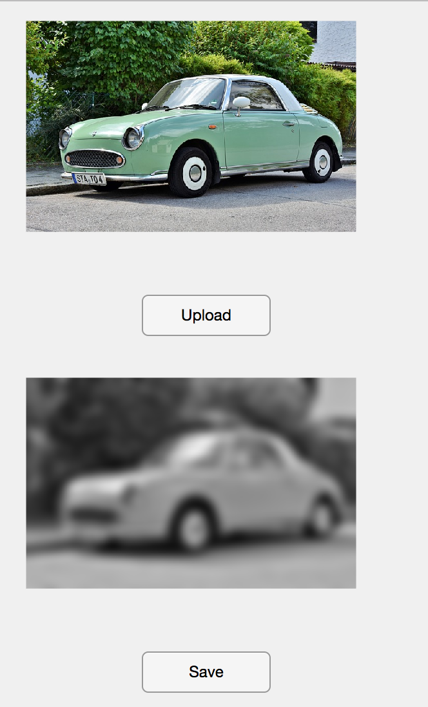
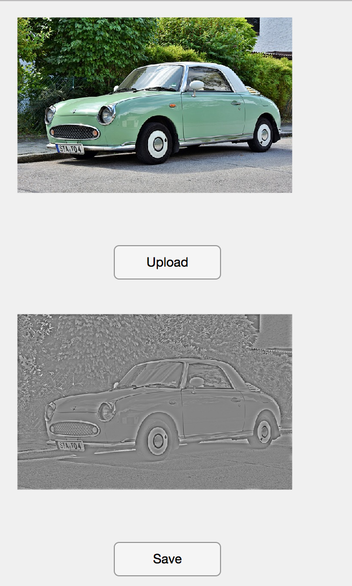
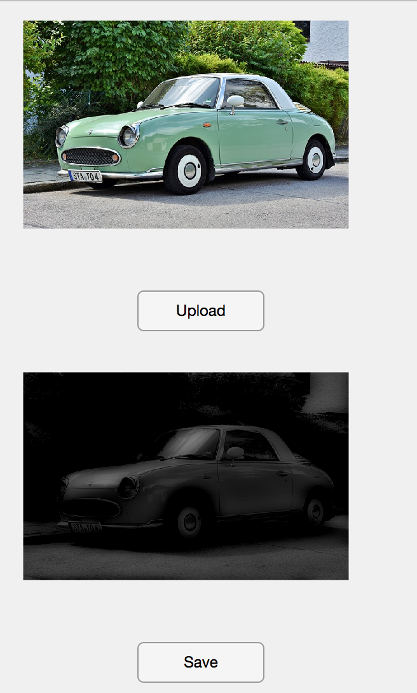
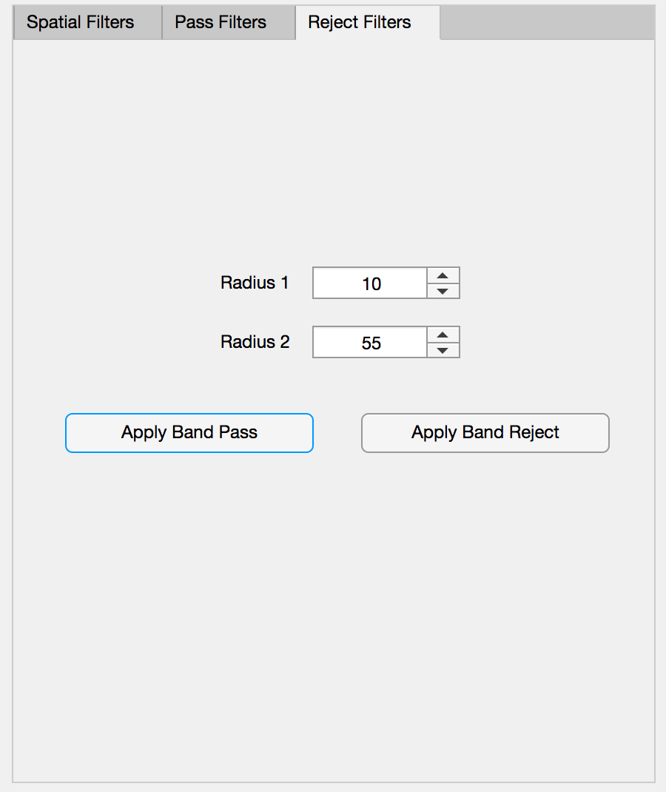
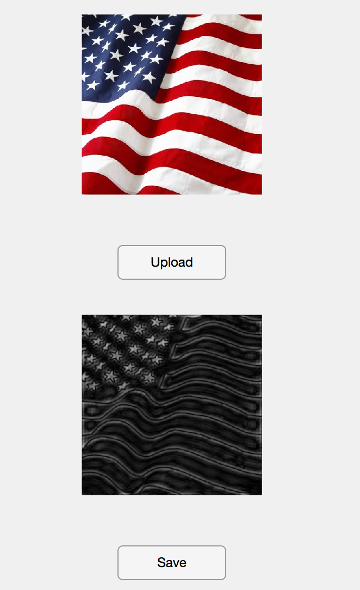
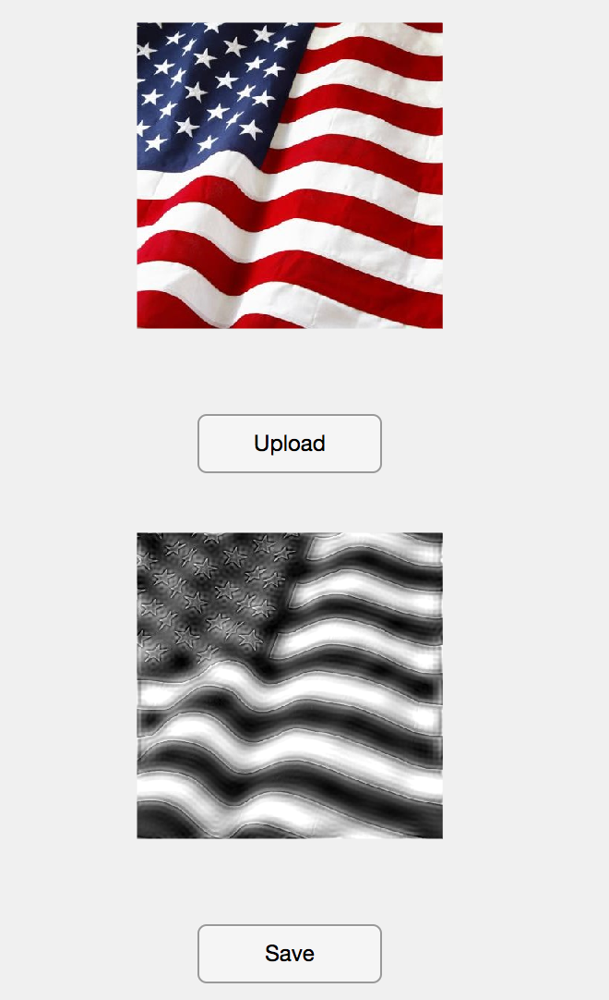
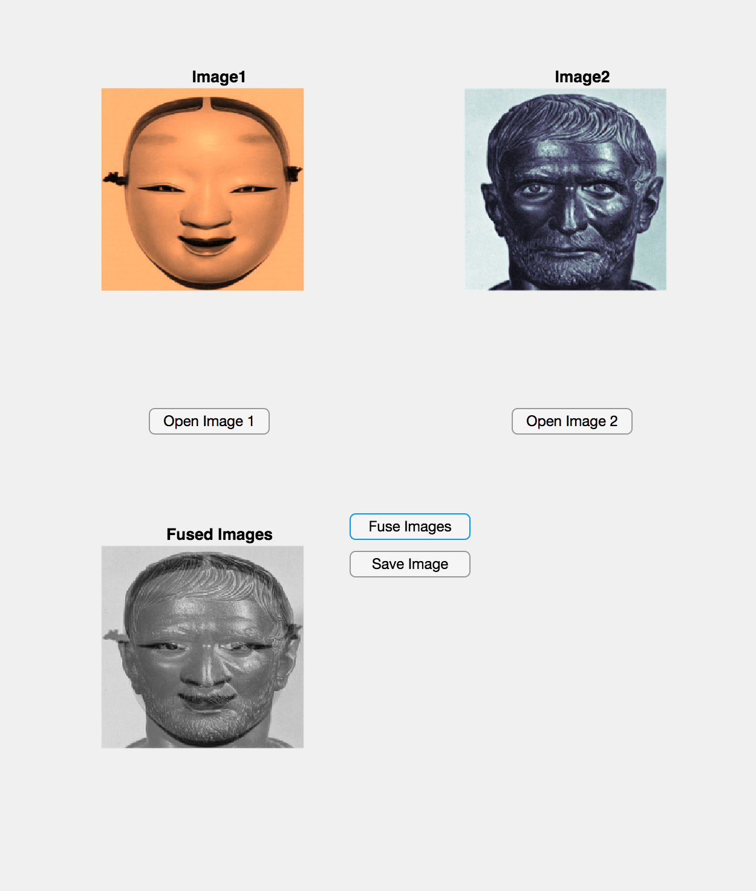

Image Processing Package
========================
This repository contains a standalone image package (prototype package) independent of the operating system. It implements 
features coverering various aspects of image processing concepts and techniques. The package is developed using [MATLAB's 
App Designer](https://www.mathworks.com/products/matlab/app-designer.html). 

# Requirements 
* MATLAB R2018a

# Steps to run the package
* Install MATLAB R2018a. Also works with higher versions as long as it is compatible.
* Launch App Designer from MATLAB.
* Open mainapp.mlapp

# Features
The tool allows to open a local image, process it and save the processed image.
## Convert images into different color models (CMYK, RGB, CMY, HSI)
- CMYK Model

  
  
- | RGB                                              |  CMY                                             | HSI                                              |
  |--------------------------------------------------|--------------------------------------------------|--------------------------------------------------|
  |||| 
#
## Enhance images quality (histogram processing)
- Brightness (0.1 - 0.9) and contrast (0.1 - 0.9) values can be set to control histogram processing.

|                                                            |                                                            |
|------------------------------------------------------------|------------------------------------------------------------|
|         |          |

#
## Apply Transformations

|                             Wavelet Transform              |       Fourier Transform                                    |
|------------------------------------------------------------|------------------------------------------------------------|
|            |            |

| Scale                                        |  Translate                                       | Rotate                |
|----------------------------------------------|--------------------------------------------------|--------------------------------------------------|
|||| 

#
## Add noise to images
- Non-repetitive noise
  - Gaussian, localvar, poisson, salt & pepper or speckle noise can be added to the image.
  - Mean, varince and noise density parameters are provided to tune the noise.
- Repetitive noise 
  - It can be added using the parameters sine angle and cycles.
  

#
## Filter Images
- Spatial Domain
  - Various kernel sizes are provided as options to apply spatial filter.
  - Predefined 2-D filters: Laplacian filter (alpha - [0,1]), Motion filter, Prewitt filter & Sobel filter.
  
  
    
 - Frequency Domain
   - Gaussian high pass and low pass filters
   - Butterworth high pass and low pass filters
   - Band pass and reject filters
  
  **Gaussian high pass**
  
  
 
  | Gaussian low pass                                |  Butterworth high pass                             | Butterworth low pass|
  |--------------------------------------------------|----------------------------------------------------|-----------------------|
  |||| 
  
  | Menu                                     |  Band pass                                       | Band reject      |
  |----------------------------------------------------|--------------------------------------------------|------------------|
  |||| 
    
#
## Fuse images

