# Image Processing Package
This repository contains a standalone image package (prototype package) independent of the operating system. It implements 
features coverering various aspects of image processing concepts and techniques. The package is developed using [MATLAB's 
App Designer](https://www.mathworks.com/products/matlab/app-designer.html). 

## Requirements 
* MATLAB R2018a

## Steps to run the package
* Install MATLAB R2018a. Also works with higher versions as long as it is compatible.
* Launch App Designer from MATLAB.
* Open mainapp.mlapp

## Features
The tool allows to open a local image, process it and save the processed image.
### Convert images into different color models (CMYK, RGB, CMY, HSI)
- CMYK Model

  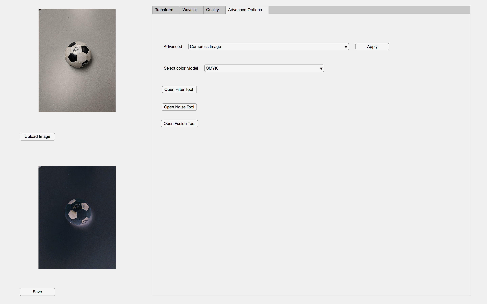
  
- | RGB                                              |  CMY                                             | HSI                                              |
  |--------------------------------------------------|--------------------------------------------------|--------------------------------------------------|
  |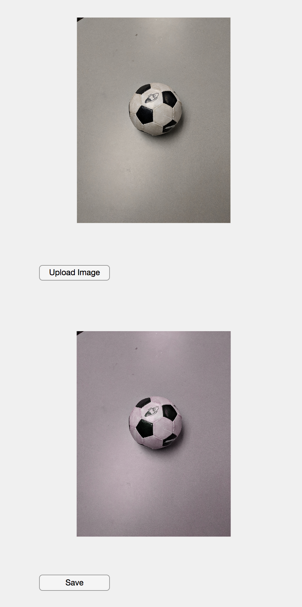|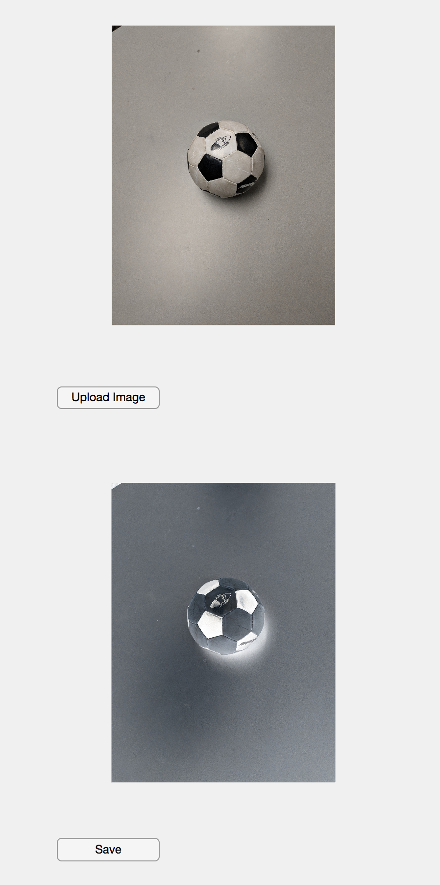|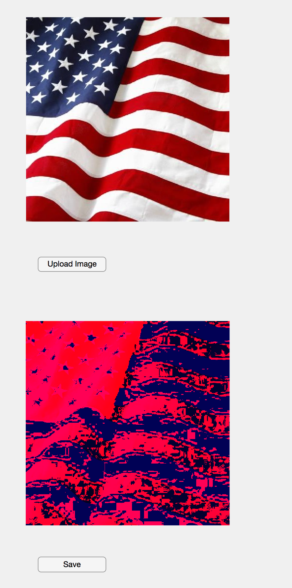| 
#
### Enhance images quality (histogram processing)
- Brightness (0.1 - 0.9) and contrast (0.1 - 0.9) values can be set to control histogram processing.

|                                                            |                                                            |
|------------------------------------------------------------|------------------------------------------------------------|
| 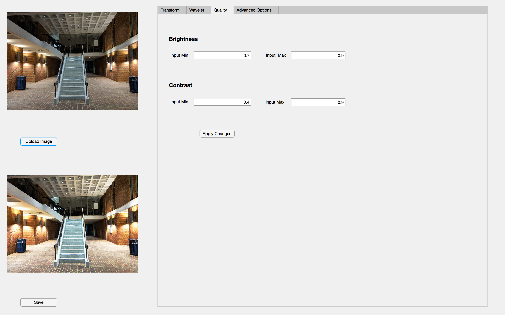        | 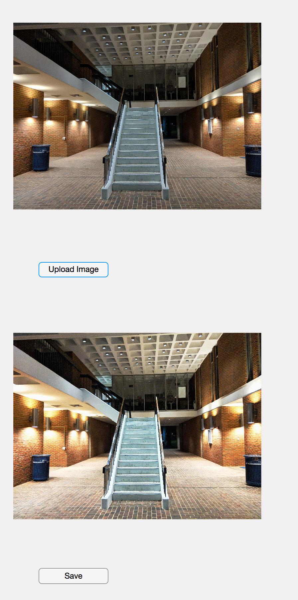         |

#
### Apply Transformations

|                             Wavelet Transform              |       Fourier Transform                                    |
|------------------------------------------------------------|------------------------------------------------------------|
| 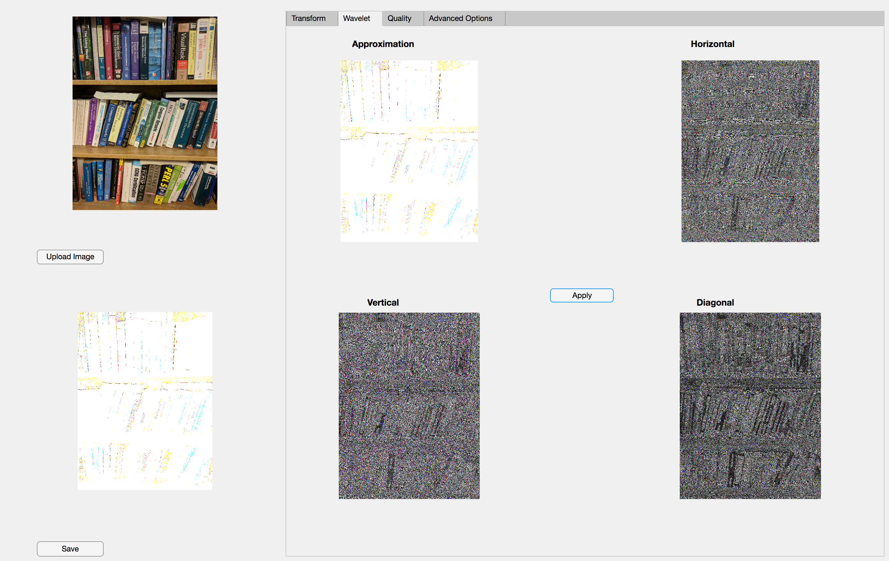           | 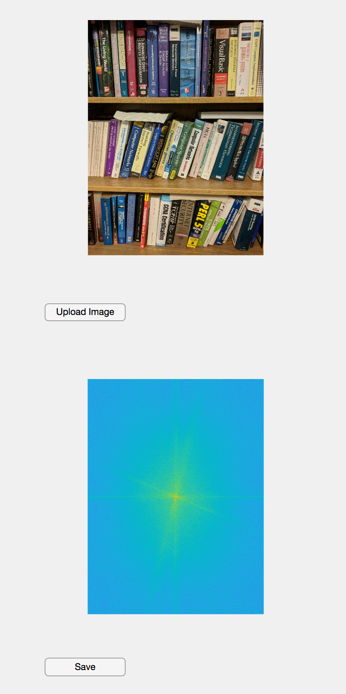           |

| Scale                                        |  Translate                                       | Rotate                |
|----------------------------------------------|--------------------------------------------------|--------------------------------------------------|
|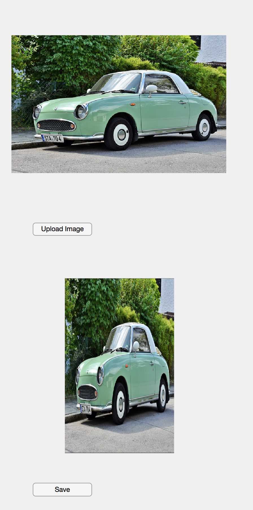|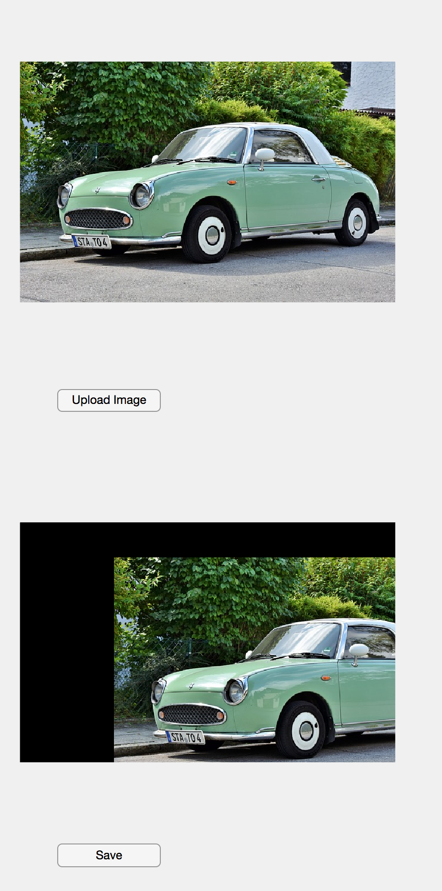|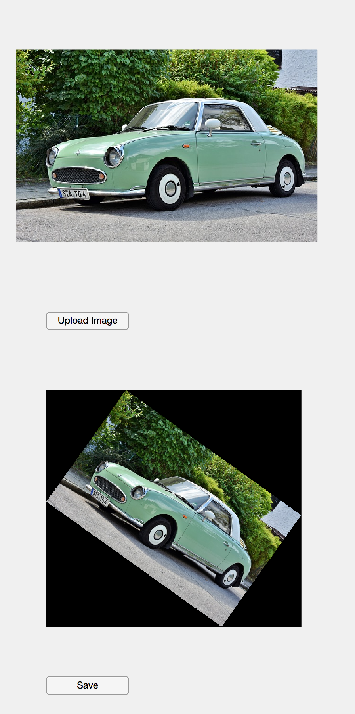| 

#
### Add noise to images
