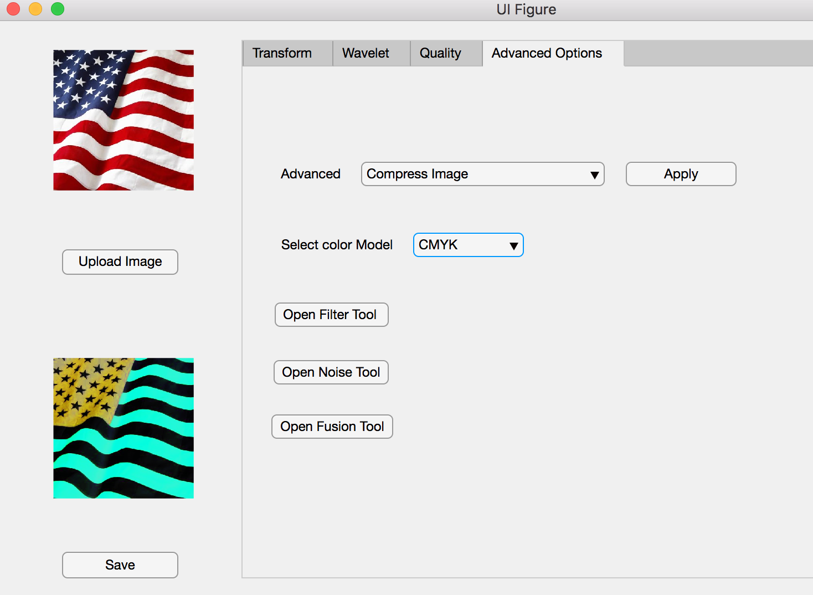
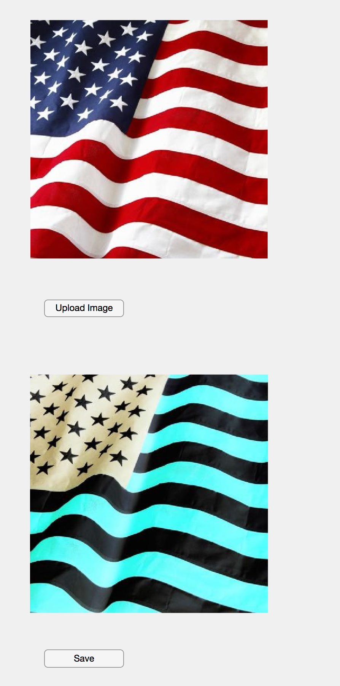

# Image-Processing-Package
This repository contains a standalone image package (prototype package) independent of the operating system. It implements 
features coverering various aspects of image processing concepts and techniques. The package is developed using [MATLAB's 
App Designer](https://www.mathworks.com/products/matlab/app-designer.html). 

# Features
The tool allows to open a local image, process it and save the processed image.
### Convert images into different color models (CMYK, RGB, CMY, HSI)
- CMYK Model

  
  
- | RGB                                              |  CMY                                             | HSI                                              |
  |--------------------------------------------------|--------------------------------------------------|--------------------------------------------------|
  |||| 
